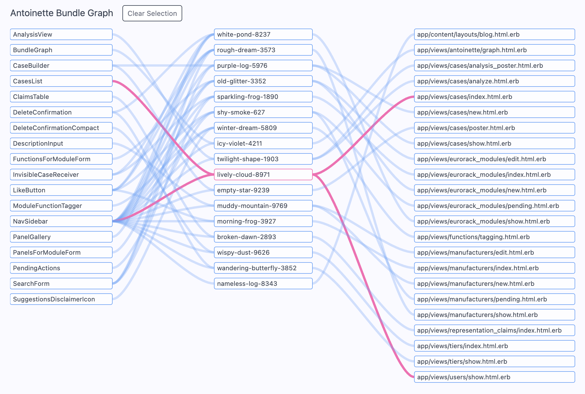

# Antoinette


Imagine you have a Rails app with numerous Elm features. You haven't gone the
SPA route; some Elm apps control the entire page, but many just provide bits
and pieces of useful functionality. This is [the officially recommended way to
bring Elm into a project](https://elm-lang.org/news/how-to-use-elm-at-work);
Evan Czaplicki called it "_the_ success path."

However, if you take that far enough, you reach a threshold where you have a
bunch of little Elm features throughout your site. If you don't want to switch
to an SPA, but you don't also want to send code down the wire that your app
won't use, you're at a crossroads.

This is the problem Antoinette solves.

Antoinette is a lightweight JS bundler which weaves Elm apps into JavaScript
bundles, and weaves JavaScript bundles into Rails templates.

It looks at `app/views` to make a hash which maps every Elm app referenced in
the templates to every template which references them. It uses that mapping to
create a set of JS bundles such that every Rails template will download all of
the Elm apps it needs, but no Rails template will download any Elm app it
doesn't need. Antoinette also creates a visualizer, as an Elm app in a Rails
view, which you can use to understand its output.

Here's an example screenshot. In the actual Elm app, you can hover over any
given bundle to see which Elm apps it places within which Rails templates.



The name was inspired by mansion weave, a style of flooring based on woven elm
wood, which was popular in French mansions from the 16th century onwards.

## Installation

Add this line to your application's Gemfile:

```ruby
gem "antoinette"
```

Run the installer:

```bash
bin/rails generate antoinette:install
```

This creates:
- `config/antoinette.json` - Bundle configuration
- `app/client/` - Directory for Elm source files
- `app/client/BundleGraph.elm` and `app/client/Sankey.elm` - Admin visualization
- `bin/antoinette` - CLI binstub
- `app/assets/javascripts/antoinette/` - Bundle output directory

It also adds a route for `/antoinette` admin page, and adds
`app/assets/javascripts/antoinette` to your `.gitignore`.

## Usage

### Configuration

Generate bundle configuration by analyzing which Elm apps are used in your Rails views:

```bash
bin/antoinette config
```

To include custom view directories (outside `app/views/`):

```bash
bin/antoinette config --custom_views app/content/layouts/
```

### Building

Compile all Elm bundles and inject script tags into templates:

```bash
bin/antoinette build
```

### Updating Specific Apps

Rebuild only the bundles for specific Elm apps:

```bash
bin/antoinette update app/client/SearchForm.elm app/client/CaseBuilder.elm
```

### Clearing

Remove all generated bundles and script tags:

```bash
bin/antoinette clear
```

### Admin Dashboard

Visit `/antoinette` to see an interactive Sankey diagram showing how Elm apps
flow into bundles and then into Rails templates.

## How It Works

1. **Analysis**: Scans Rails views for `Elm.AppName.init` patterns
2. **Grouping**: Groups templates that use the same combination of Elm apps
3. **Bundling**: Compiles each group into a single JavaScript bundle (with a haiku-styled name like `holy-waterfall-8432`)
4. **Injection**: Adds `javascript_include_tag` to templates with SHA1 digest comments for idempotent updates

### Script Tag Format

Antoinette injects script tags like:

```erb
<%= javascript_include_tag "antoinette/holy-waterfall-8432" %> <!-- antoinette a1b2c3d4... -->
```

Embedding a hash in the comment ensures that tags only get updated when bundle content changes.

The price is git commit noise, but what you get for it is systematically optimized JS download speed.

## Requirements

- Rails 7.0+
- Elm (customizable via `elm_path` in `config/antoinette.json`)

## Configuration

The `config/antoinette.json` file structure:

```json
{
  "elm_path": "elm",
  "bundles": [
    {
      "name": "holy-waterfall-8432",
      "elm_apps": ["CaseBuilder", "SearchForm"],
      "templates": ["app/views/cases/new.html.erb"]
    }
  ],
  "custom_view_paths": ["app/content/layouts/"]
}
```

## Rake Integration

The `antoinette:build` task runs automatically before `assets:precompile`:

```bash
rake antoinette:build
rake assets:precompile  # runs antoinette:build first
```

## License

MIT
